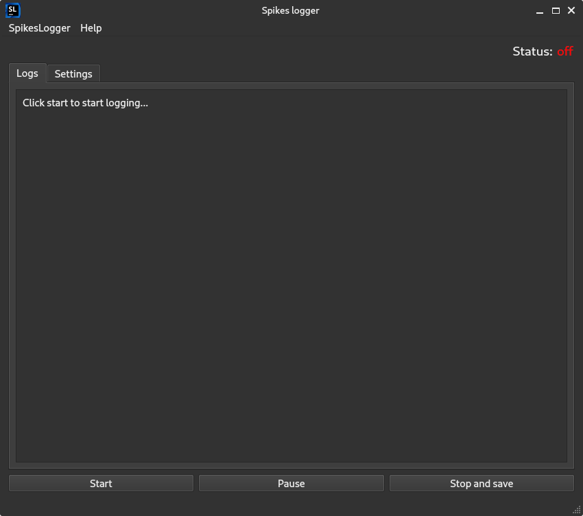

## Warnings!
- ### [python sucks](https://gitlab.com/TzintzeneT/dont-use-python), do not use python at home.
- ### Windows "defender" sucks, you can see that this app is no virus, it is open source.
# SpikesLogger


Welcome to the official SpikesLogger repo!
this app is the desktop part of the SpikesLogger real-time FRC logger.
The SpikesLogger uses the NetworkTables server on the roboRIO to log values from the robot to your computer.

You can download the latest release from [here](https://github.com/Spikes-2212-Programming-Guild/SpikesLogger/releases), or build it yourself with the [commands below](#build-commands).
the SpikesLogger is designed to replace the System.out.println() statement you use every time you want to log some value when you run your code.
it is meant to be used for debugging but feel free to use it as you want.

# Logging Values
1. _FIRST_, from your computer connect to your robot's network, then set the "server IP" in the app settings to your roborio's IP.
2. _SECOND_, as explained below, to log the values from your robot, you can use a couple of methods.

**note:** make sure to not log the temp value in the app settings, otherwise it will not be logged.
if for some odd reason you want to log "SeaOttersAreSoFuckingCuteINeedThemInMyRoomRightNow",
you can change it to a different value.

### Using SpikesLib2
you can [install SpikesLib2](https://github.com/Spikes-2212-Programming-Guild/SpikesLib2#installation) 
and use the built-in SpikesLogger using 
```
SpikesLogger sl = new SpikesLogger();
```
you can use the regular log function with:
```
sl.log(value);
```

and you can use the log command:
```
sl.logCommand(value);
```
There are also the `logWithTimestamp` and `logWithTimestampCommand`
to log your values with a timestamp.

### Using the NetworkTables Directly
Although not recommended, you can put the values that you want to log at a certain location in the NetworkTables, for example: SpikesLogger/output.
After that, you need to put that NetworkTables location at the "Logger Location" in the app settings and hit apply.

**make sure** to not update the value periodically unless you want to log that same value periodically.

this method is not recommended because you can accidentally put the value in the wrong place,
or do other stupid things you won't notice and will drive you insane.


### Creating Your Own Robot Logger
You can create your own robot logger in your preferred language (Java/C++/Python) to use with this desktop app.
You can take a look at the [SpikesLogger class](https://github.com/Spikes-2212-Programming-Guild/SpikesLib2/blob/dev/src/main/java/com/spikes2212/dashboard/SpikesLogger.java)
in SpikesLib2 for inspiration or just create one from scratch.
To do that, you'll need to make sure you are putting all of the values at the same location at the NetworkTables,
and you also need to put the "Logger Location" in the desktop app settings as that NetworkTables location.


# Build Commands:
### for linux:
```commandline
 pyinstaller --onefile --add-data "SpikesLoggerSmallLogo.png:." SpikesLogger.py
```
### for windows and mac:
```commandline
 pyinstaller --onefile --windowed --icon=SpikesLoggerIcon.ico --add-data "SpikesLoggerSmallLogo.png:." SpikesLogger.py
```

## convert the .ui GUI file to Python
```commandline
pyuic6 LoggerGUI.ui -o LoggerGUI.py
```

## created using pain and FOSS
This app is licensed under the awesome GPLv3 licence, and written in Python (unfortunately).

### other projects making this app possible:
- QT (PyQt6, Qt Designer)
- RobotPy (PyNetworkTables)
- pyinstaller (Compiling this)
- GIMP (logo design)
- PyCharm (because VSCode is broken and PyCharm is awesome unlike python)